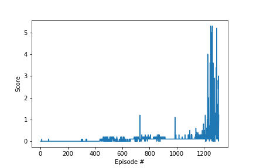

# Learning Algorithm

I implemented a MADDPG algorithm to train the agents. Each agent shares the same actor and critic models. The input to the actor model is a single stacked observation for one agent and the ouput is an individual action. The critic takes as input the observations and actions for both tennis agents at once. The actor and critic models consists of 3 hidden layers with 128 leaky-ReLU units each.

Here are the hyper parameters used for training.

* BUFFER_SIZE = int(1e5)  (replay buffer size)
* BATCH_SIZE = 128        (minibatch size)
* GAMMA = 0.99            (discount factor)
* TAU = 1e-3              (for soft update of target parameters)
* LR_ACTOR = 1e-5         (learning rate of the actor)
* LR_CRITIC = 1e-4        (learning rate of the critic)
* WEIGHT_DECAY = 0        (L2 weight decay)

At each step of the environment `(state, action, reward, next_state, done)` tuples are computed for both agents and added to the replay buffer.

# Plot of Rewards (each point is a mean over all 20 agents)

# Ideas for Future Work
Testing out other algorithms besides MADDPG, for example MA-PPO would be a good idea. Also, training using multiple parallel environments may speed up training time.